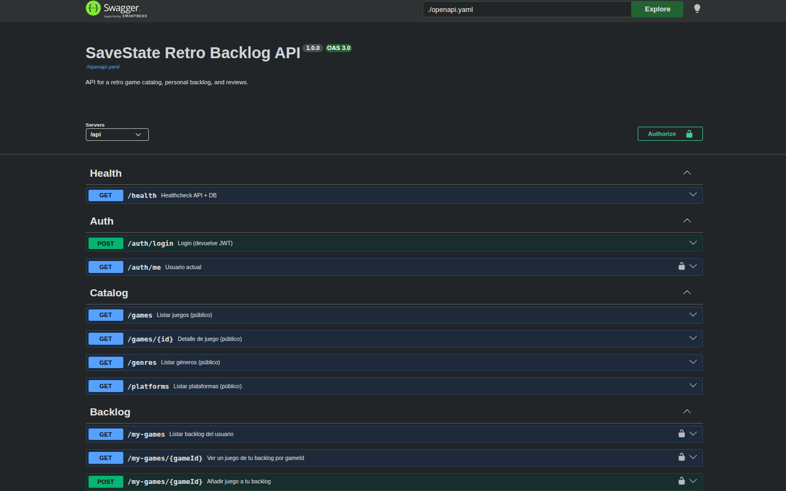
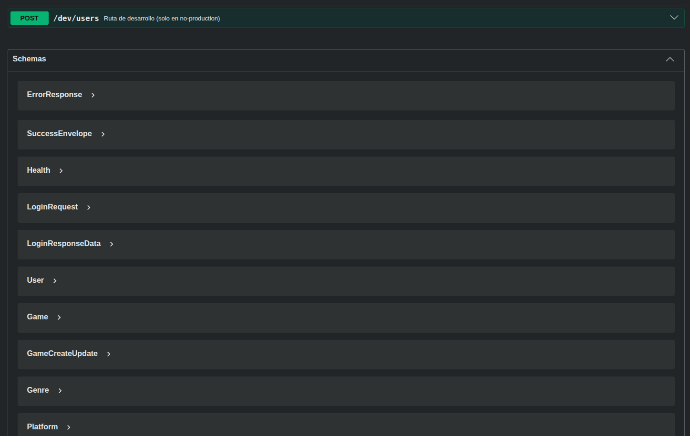
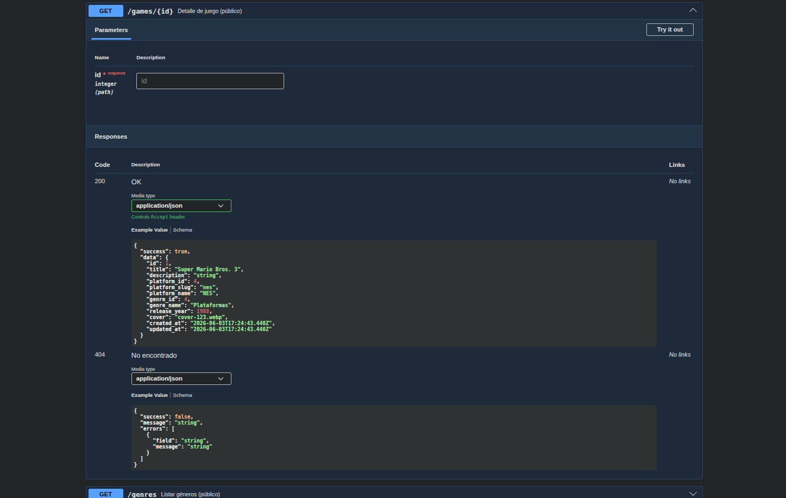
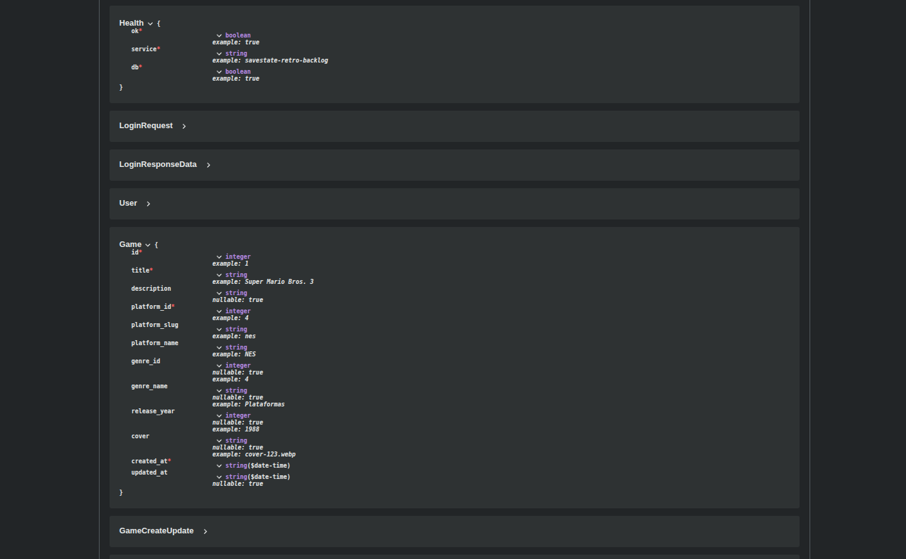

# SaveState Retro Backlog

A small full-stack app to track retro games: **pending**, **playing**, **completed**, and **abandoned**.

## Screenshots


<details>
<summary>More screenshots</summary>

| Login | My backlog |
|:---:|:---:|
|  |  |

| Admin (create game) | Admin (edit game) |
|:---:|:---:|
|  |  |

</details>

## Stack

- **Frontend**: React (Vite) + Tailwind CSS
- **Backend**: Node.js + Express (JWT auth)
- **Database**: PostgreSQL (Docker)
- **API**: OpenAPI ([`openapi.yaml`](openapi.yaml))

## Quick start (Docker)

```bash
cp .env.example .env
cp backend/.env.example backend/.env
# Edit backend/.env and set a strong JWT_SECRET
```

### Admin user (first run)

Registration is disabled. Set these env vars in `.env` (copy from `.env.example`) and the API will create the admin user on startup if it doesn't exist:

- `ADMIN_EMAIL`
- `ADMIN_PASSWORD`
- `ADMIN_DISPLAY_NAME` (optional)

On first run, PostgreSQL loads `backend/database/schema.sql` and `seed.sql`.

### Ports (same in dev and Ubuntu server)

| Service    | Port | URL |
|------------|------|-----|
| Frontend   | 5175 | http://localhost:5175/ |
| API        | 3030 | http://localhost:3030/api |
| API health | 3030 | http://localhost:3030/api/health |
| Swagger UI | 3035 | http://localhost:3035/ |
| pgAdmin    | 5055 | http://localhost:5055/ (dev only) |

On the LAN, replace `localhost` with your server IP (e.g. `http://192.168.1.50:5175/`).

```bash
curl -sS http://localhost:3030/api/health
```

### Development (hot reload)

```bash
docker compose up --build
```

### Ubuntu server (LAN)

Built images on a **private** home server. Set `VITE_API_URL` / `VITE_FILES_URL` in `.env` to `http://<server-lan-ip>:3030/...` before `--build`. Details: [Run on a private Ubuntu server](docs/deploy-ubuntu-server.md).

```bash
docker compose -f docker-compose.prod.yml up --build -d
```

## Documentation

- [Run on a private Ubuntu server](docs/deploy-ubuntu-server.md)
- [OpenAPI](docs/openapi.md)
<details>
<summary>OpenAPI (Swagger UI)</summary>

| API overview | Schemas |
|:---:|:---:|
|  |  |

| Endpoint detail | Schema models |
|:---:|:---:|
|  |  |

</details>
