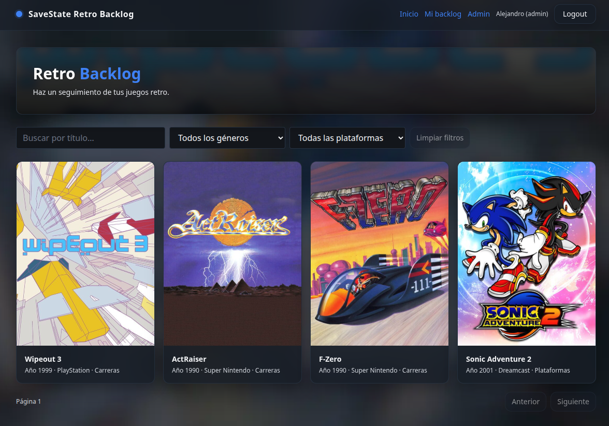
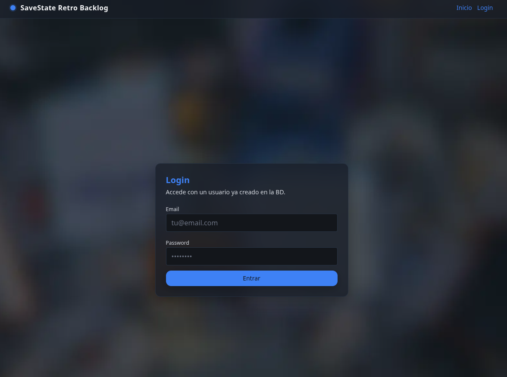
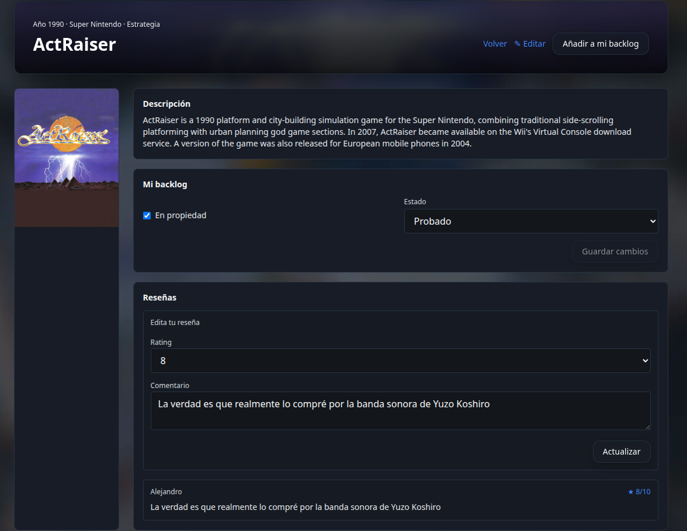
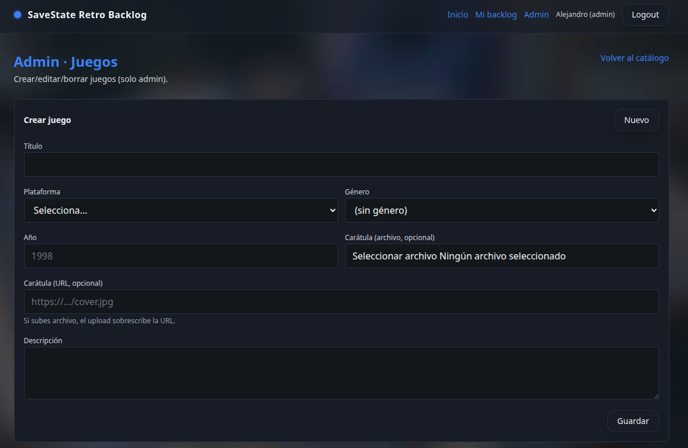
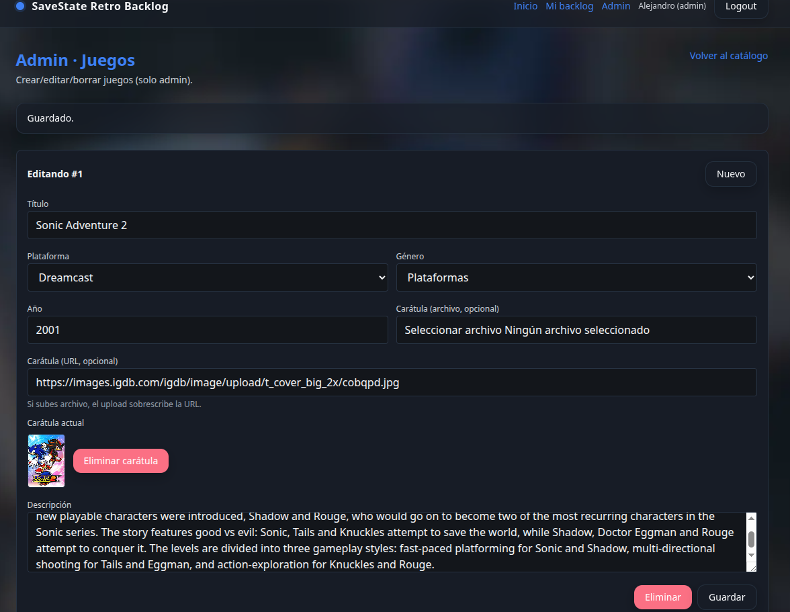

# SaveState Retro Backlog

A small full-stack app to track retro games: **pending**, **playing**, **completed**, and **abandoned**.

## Screenshots



<details>
<summary>More screenshots</summary>

| Login | My backlog |
|:---:|:---:|
|  |  |

| Admin (create game) | Admin (edit game) |
|:---:|:---:|
|  |  |

</details>

## Stack

- **Frontend**: React (Vite) + Tailwind CSS
- **Backend**: Node.js + Express (JWT auth)
- **Database**: PostgreSQL (Docker)
- **API**: OpenAPI ([`openapi.yaml`](openapi.yaml))

## Quick start (Docker)

```bash
cp .env.example .env
cp backend/.env.example backend/.env
# Edit backend/.env and set a strong JWT_SECRET

docker compose up --build
```

### Admin user (first run)

Registration is disabled. Set these env vars in `.env` (copy from `.env.example`) and the API will create the admin user on startup if it doesn't exist:

- `ADMIN_EMAIL`
- `ADMIN_PASSWORD`
- `ADMIN_DISPLAY_NAME` (optional)

| Service  | URL |
|----------|-----|
| Frontend | http://localhost:5173 |
| API      | http://localhost:3000/api/health |

Health check:

```bash
curl -sS http://localhost:3000/api/health
```

On first run, PostgreSQL loads `backend/database/schema.sql` and `seed.sql`.

## Documentation

- [Deploy on Ubuntu Server](docs/deploy-ubuntu-server.md)
- [OpenAPI](docs/openapi.md)
